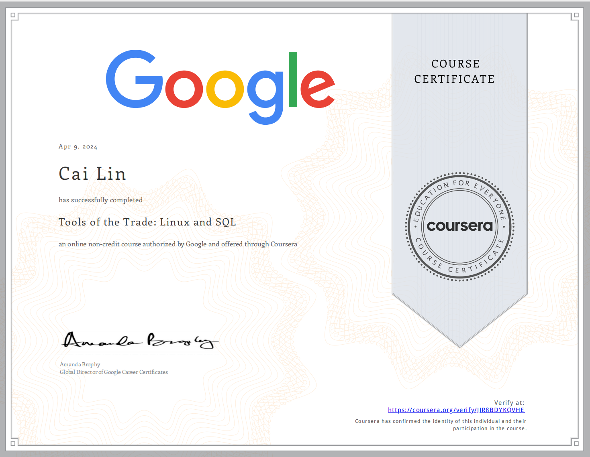

# Tools-of-the-Trade-Linux-and-SQL

## Module 1: Introduction to operating systems

## Module 2: The Linux operating system

## Module 3: Linux commands in the Bash shell

## Module 4: Databases and SQL 

 

# Proof of Completion

